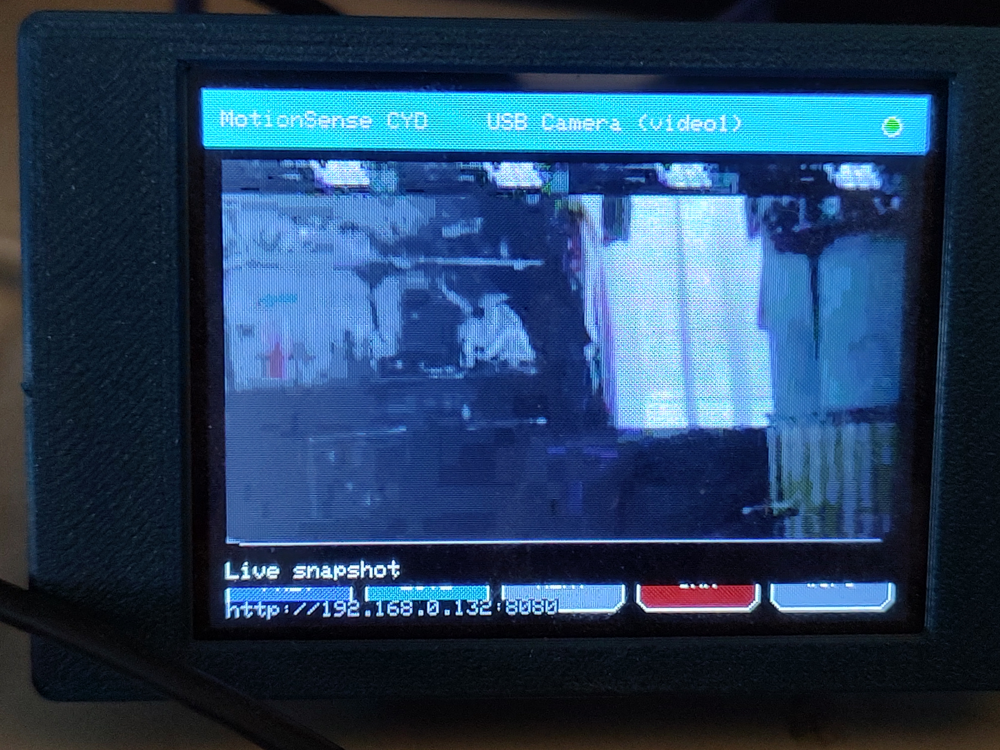
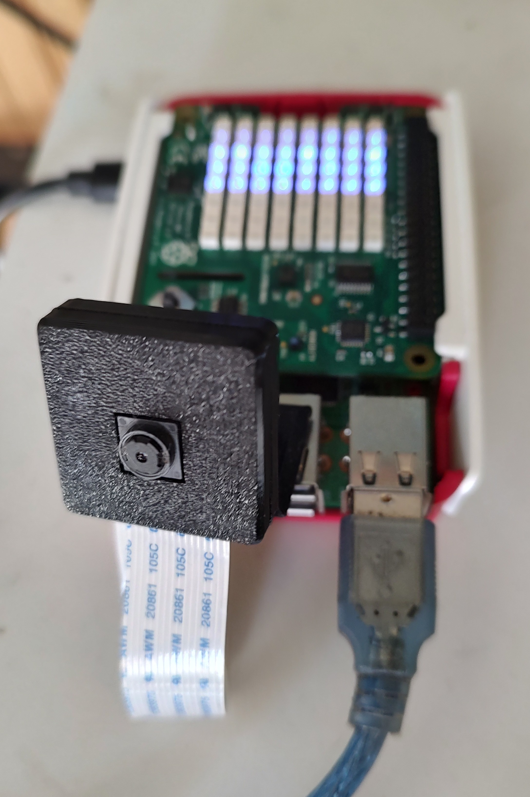
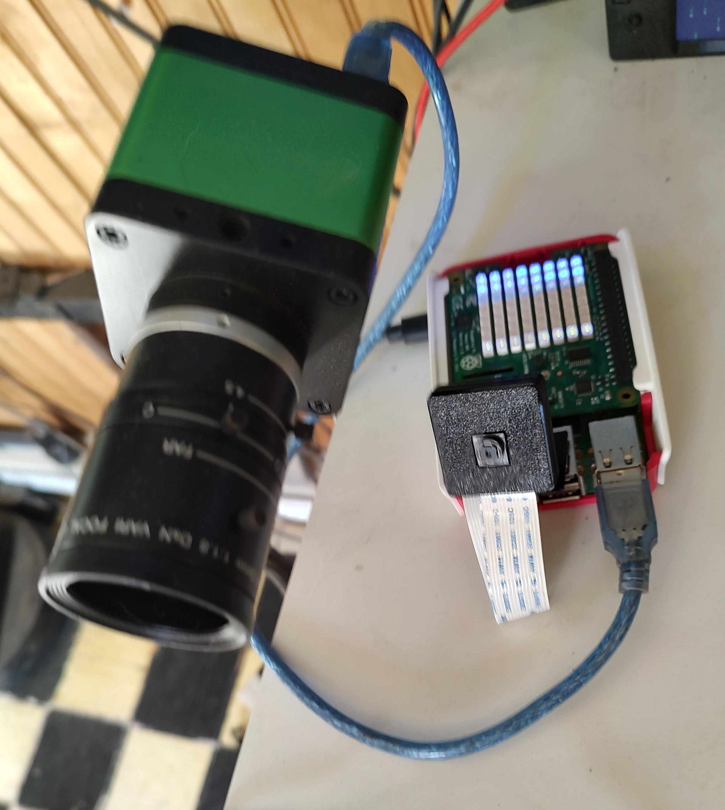
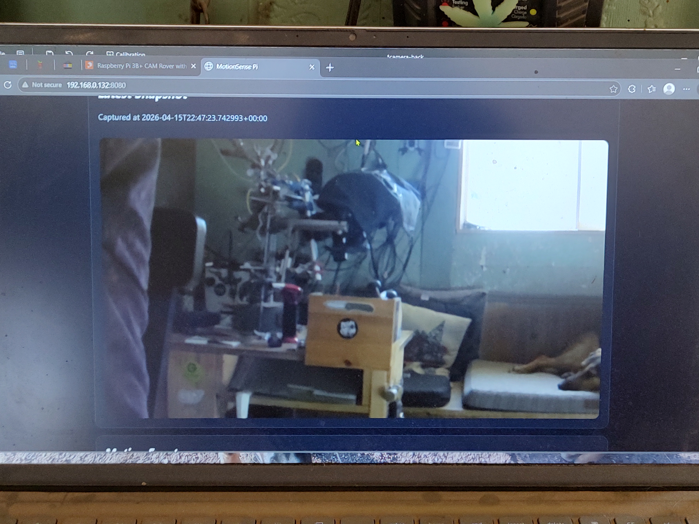
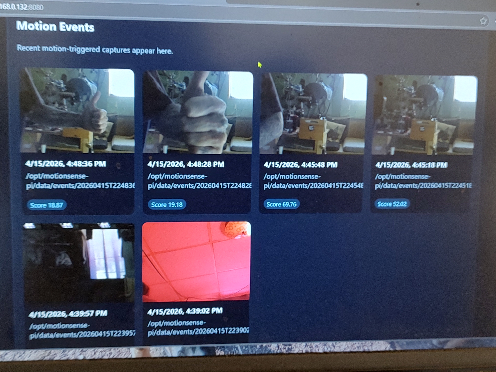
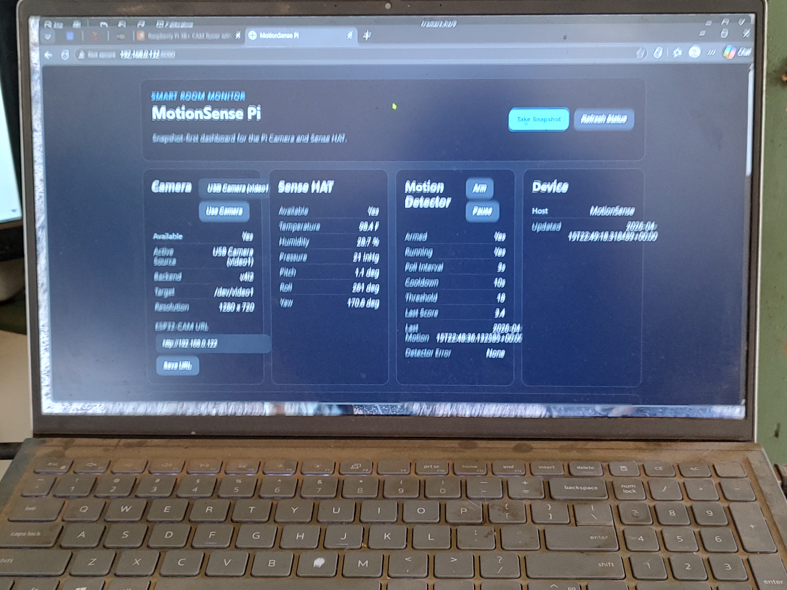

# MotionSense Pi

MotionSense Pi is a snapshot-first smart room monitor built around a Raspberry Pi 3 B, Pi Camera v2.1, Sense HAT, an optional USB webcam, an ESP32-CAM network camera, and a CYD touchscreen companion.

It started as a custom build inspired by the product direction of motionEye, but the codebase here is original and tailored to this hardware stack.

## What it does

- serves a local Flask dashboard on port `8080`
- captures snapshots from:
  - the Pi Camera with `rpicam-still`
  - a USB webcam with `v4l2-ctl`
  - an ESP32-CAM over HTTP
- lets you switch camera sources from the browser UI and CYD
- can run timed interval captures for stop-motion-style snapshots
- stores the latest snapshot plus recent motion-triggered events
- keeps recent events and archive views aligned with the saved event files on disk
- can auto-prune the oldest saved event photos when free disk space gets low
- runs lightweight frame-difference motion detection on the Pi
- reads Sense HAT telemetry and shows:
  - temperature in Fahrenheit
  - humidity in percent
  - pressure in inHg
  - orientation
- uses simple Sense HAT LED behavior:
  - dim blue idle animation
  - blue flash on successful capture
  - red on camera fault
- includes two companion firmware targets:
  - `firmware/esp32cam` for an AI Thinker ESP32-CAM
  - `firmware/cyd` for an ESP32-2432S028R CYD touch display

## Current system layout

```text
Pi Camera / USB Webcam / ESP32-CAM
                |
                v
         MotionSense Pi Flask app
                |
      +---------+---------+
      |                   |
      v                   v
 browser dashboard     CYD companion
```

## Main components

### Raspberry Pi app

- `app/camera.py`  
  camera-source abstraction, source switching, Pi/USB/network capture, persisted camera config

- `app/motion.py`  
  background motion detector, event history, low-resolution probe captures

- `app/sensehat.py`  
  Sense HAT sensor readings plus simplified LED status behavior

- `app/monitor.py`  
  aggregates camera, motion, snapshot, and Sense HAT state for the UI/API

- `app/web.py`  
  Flask routes for the dashboard and JSON endpoints

### Browser UI

The browser dashboard supports:

- manual snapshot capture
- auto capture start/stop in either timer mode or motion-triggered combo mode
- configurable motion poll interval
- configurable motion cooldown and threshold
- configurable 1-5 photo burst capture for manual and motion-triggered snapshots
- selectable capture resolution from safe preset camera modes
- selectable lighting presets for the Pi Camera:
  - auto
  - daylight
  - fluorescent
  - indoor
  - low light
- one-click 90 degree camera rotation with persisted orientation for live and saved images
- camera source selection for the Pi Camera, supported USB webcams, and optional ESP32-CAM
- ESP32-CAM URL storage
- motion detector arm/pause
- latest snapshot view from the saved `latest.jpg`
- recent motion and timed-capture previews that show the whole image without thumbnail cropping
- click-to-open fullscreen event viewer with keyboard navigation:
  - left arrow for previous image
  - right arrow for next image
  - escape to close
- a fullscreen **Move to Gallery** action for archived photos
- per-image and bulk delete/download controls for motion event images
- a full browser archive page for older saved event images
- a separate browser gallery page for photos moved out of the archive
- Sense HAT telemetry

### ESP32-CAM firmware

The ESP32-CAM firmware:

- exposes `GET /latest.jpg`
- exposes `GET /status`
- uses WiFiManager captive portal setup
- can clear WiFi settings from:
  - `GET /wifi/reset`
  - **GPIO13 held to GND during boot/reset**

### CYD firmware

The CYD firmware:

- uses WiFiManager captive portal setup
- stores the MotionSense Pi base URL
- defaults plain host/IP entries to port `8080`
- strips pasted paths like `/api/status` down to the base URL
- shows the latest snapshot or browsed motion event
- cycles camera sources from the touchscreen
- can clear WiFi + Pi URL config from:
  - the on-screen **WIFI** button
  - the **BOOT** button during the startup recovery window

## API surface

Key endpoints used by the browser UI and CYD:

- `GET /api/status`
- `POST /api/capture`
- `POST /api/timer/start`
- `POST /api/timer/stop`
- `POST /api/motion/start`
- `POST /api/motion/stop`
- `POST /api/camera/source`
- `POST /api/camera/network`
- `POST /api/camera/rotate`
- `GET /api/events`
- `POST /api/events/move-to-gallery`
- `GET /api/gallery`
- `GET /snapshot.jpg`
- `GET /events/<filename>`
- `GET /gallery-images/<filename>`

## Project layout

```text
app/
  camera.py
  motion.py
  monitor.py
  sensehat.py
  web.py
  static/
  templates/
deploy/
  install_on_pi.sh
firmware/
  cyd/
    platformio.ini
    src/main.cpp
  esp32cam/
    platformio.ini
    src/main.cpp
images/
tests/
main.py
requirements.txt
```

## Run locally

```bash
python3 -m venv .venv
. .venv/bin/activate
pip install -r requirements.txt
python main.py
```

Default local URL:

```text
http://127.0.0.1:8080
```

## Install on the Pi

Copy the project to the Pi, then run:

```bash
cd /opt/motionsense-pi
./deploy/install_on_pi.sh
```

The installer:

- installs Python and Sense HAT dependencies
- enables I2C when `raspi-config` is available
- recreates the virtual environment
- installs Python requirements
- writes the `motionsense-pi` systemd service
- restarts the app on port `8080`

## Storage and retention

- motion and timed-capture images are stored on disk in `data/events`
- moved gallery images are stored separately in `data/gallery`
- the latest snapshot is stored separately as `data/latest.jpg`
- the dashboard recent-events strip and archive both read from the saved event files
- moved photos are removed from the archive list so they only appear in the gallery
- MotionSense Pi now keeps capturing until free space drops below a safety floor
- when free space falls under **5 GB**, the app deletes the **oldest saved event photos first** so the Pi can keep saving new events without filling the filesystem

After install:

```text
http://<pi-ip>:8080
```

## ESP32-CAM firmware

Build:

```bash
cd firmware/esp32cam
pio run
```

Flash:

```bash
cd firmware/esp32cam
pio run -t upload --upload-port /dev/ttyUSB0
pio device monitor --port /dev/ttyUSB0
```

Typical flashing notes:

1. hold **GPIO0 LOW** to enter flash mode
2. reset or power-cycle while flashing
3. remove the GPIO0 jumper after upload
4. reset again to boot normally

First-time setup:

1. join the captive portal AP named like `motionsense-cam-XXXXXX-setup`
2. connect the ESP32-CAM to the same WiFi as the Pi
3. find its IP address
4. save that base URL in the MotionSense Pi dashboard
5. switch the active source to **ESP32-CAM**

## CYD firmware

Build:

```bash
cd firmware/cyd
pio run
```

Flash:

```bash
cd firmware/cyd
pio run -t upload --upload-port /dev/ttyUSB0
pio device monitor --port /dev/ttyUSB0
```

First-time setup:

1. join the `MotionSense-CYD` captive portal
2. connect the CYD to your WiFi
3. enter the MotionSense Pi URL, for example:

```text
http://192.168.0.132:8080
```

These also work:

- `192.168.0.132`
- `http://192.168.0.132:8080/api/status`

Touch controls:

- **PREV**: older motion events
- **LIVE**: latest snapshot
- **NEXT**: newer event or back to live
- **CAM**: cycle sources
- **WIFI**: clear WiFi + Pi URL config

## Validation

Python tests:

```bash
python3 -m unittest discover -s tests -v
```

Firmware builds:

```bash
cd firmware/esp32cam && pio run
cd firmware/cyd && pio run
```

## Photos

<p>
  
  
  
</p>
<p>
  
  
  
</p>

## Notes

- this project is custom-built from scratch
- motionEye was used only as a reference for product direction
- live full-motion video is intentionally deferred in favor of reliable snapshots and event review
- USB webcam behavior can still vary by device quality and driver behavior
